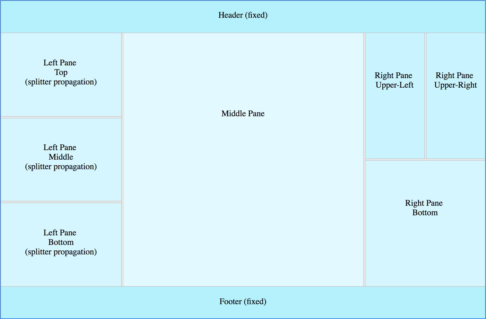

# About Re-F|ex

Re-F|ex is a React flex-based layout component library which I created because none of the components I found out there could satisfy my requirements.

It intends to address in a simple way the needs of advanced React Web applications that require resizable layouts.

Here is a basic demo:

```js
import ReactDOM from 'react-dom'
import React from 'react'

import {
  ReflexContainer,
  ReflexSplitter,
  ReflexElement
} from 'react-reflex'

/////////////////////////////////////////////////////////
// Basic vertical re-flex layout with splitter
// Adding a splitter between two ReflexElements
// will allow the user to resize them
//
/////////////////////////////////////////////////////////
class ReflexDemo extends React.Component {

  render () {

    return (
      <ReflexContainer orientation="vertical">

        <ReflexElement className="left-pane">
          <div className="pane-content">
            Left Pane (resizeable)
          </div>
        </ReflexElement>

        <ReflexSplitter/>

        <ReflexElement className="right-pane">
          <div className="pane-content">
            Right Pane (resizeable)
          </div>
        </ReflexElement>

      </ReflexContainer>
    )
  }
}

ReactDOM.render(
  <ReflexDemo/>,
  document.getElementById('reflex-demo'))
```

## Installation

```js
npm install react-reflex
```

## React Suppot

React >= 0.13.x

## Browser Support

Re-F|ex is responsive, mobile friendly and has been tested on the following browsers:

  * Chrome
  * Firefox
  * Safari
  * Internet Explorer
  * Opera
  * Edge

## Documentation & Samples

Re-F|ex is the most powerful React layout component out there ... Don't just trust me, try it!

[Click here for code samples and live demos ...](https://leefsmp.github.io/Re-Flex/index.html)



## Development

* Build the lib: `npm run build-lib` | `npm run build-lib-dev` (dev mode non-minified with source-map)
* Build the demo: `npm run build-demo` | `npm run build-demo-dev` (dev mode non-minified with source-map + watch)

* Development server `npm start`
* Run tests: `npm test`
* Continuously run tests on file changes `npm run watch-test`
